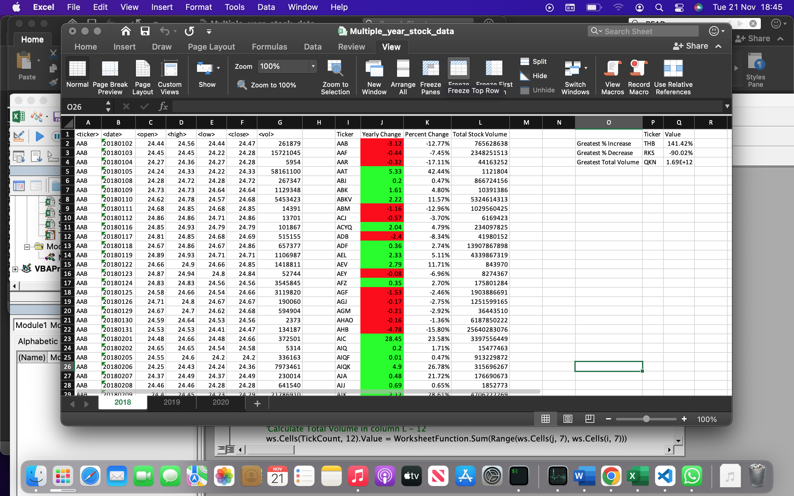

# VBA-Challenge 
## Module 2 Challenge - Stock Markert Alaysis
 

## Background

You are well on your way to becoming a programmer and Excel expert! In this homework assignment, you will use VBA scripting to analyze generated stock market data.

## Before You Begin
1. Create a new repository for this project called VBA-challenge. Do not add this assignment to an existing repository.

2. Inside the new repository that you just created, add any VBA files that you use for this assignment. These will be the main scripts to run for each analysis.

## Files 

Download the following files to help you get started: [Download files](https://static.bc-edx.com/data/dl-1-2/m2/lms/starter/Starter_Code.zip)

## Instructions

* Create a script that loops through all the stocks for one year and outputs the following information:

  * The ticker symbol.
  * Yearly change from the opening price at the beginning of a given year to the closing price at the end of that year.
  * The percentage change from the opening price at the beginning of a given year to the closing price at the end of that year.

  * The total stock volume of the stock. The result should match the following image:

* Add functionality to your script to return the stock with the "Greatest % increase", "Greatest % decrease", and "Greatest total volume". The solution should match the following image: 

* Make the appropriate adjustments to your VBA script to enable it to run on every worksheet (that is, every year) at once.

### NOTE

Make sure to use conditional formatting that will highlight positive change in green and negative change in red.

### Other Considerations

* Use the sheet `alphabetical_testing.xlsx` while developing your code. This data set is smaller and will allow you to test faster. Your code should run on this file in less than 3-5 minutes.

* Make sure that the script acts the same on each sheet. The joy of VBA is to take the tediousness out of repetitive task and run over and over again with a click of the button.

## Screenshot Solutions

### 2018
 

### 2019
 

### 2020
 